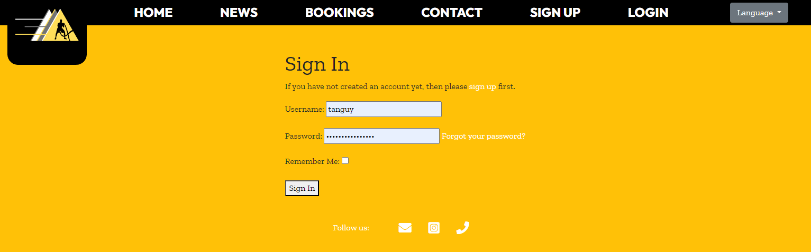

# Hugo-Marquis-Coaching-PP4

[(Developer: Tanguy L'Alexandre)](https://github.com/tlalexandre)

[Link to deployed site](https://hugo-marquis-297dbddc34dd.herokuapp.com/)

Hugo Marquis Coaching is a website for a french sports coach, to allow him to post articles, let people know when he holds classes, and allow clients to book sessions with him.

# Table Of Content

- [User Experience](#user-experience)
  - [User Stories](#user-stories)
  - [Site Goals](#site-goals)
  - [Scope](#scope)
- [Design](#design)
  - [Colour Scheme](#colour-scheme)
  - [Database Schema](#database-schema)
  - [Fonts](#fonts)
  - [Wireframes](#wireframes)
  - [Agile Methodology](#agile-methodology)
    - [Overview](#overview)
    - [EPICS(Milestones)](#epics---milestones)
    - [User Stories Issues](#user-stories---issues)
    - [GitHub Projects](#github-projectskanban)
- [Features](#features)
  - [Navigation Header](#navigation-header)
  - [Footer](#footer)
  - [Home Page](#home-page)
  - [News Page](#news-page)
    - [News Details Page](#news-details-page)
    - [Add News Page](#add-news-page)
  - [Bookings Page](#bookings-page)
    - [Bookings Page as the coach/admin](#bookings-page-as-the-coachadmin)
      - [Adding a class or an unavailability](#adding-a-class-or-an-unavailability)
      - [Unavailability Page](#unavailability-page)
      - [Updating a class](#updating-a-class)
    - [Bookings Page as a regular user](#bookings-page-as-a-regular-user)
      - [Adding a Private Session](#adding-a-private-session)
      - [Joining a Class](#joining-a-class)
    - [Private Session/Course Details Page](#private-session-details-page-and-course-details-page)
  - [Contact Page](#contact-page)
  - [Authentification](#authentification)
    - [Sign Up Page](#sign-up-page)
    - [Sign In Page](#sign-in-page)
    - [Sign Out Page](#sign-out-page)
  - [Notification Messages](#notification-messages)
  - [Error Pages](#comment-form)
- [Testing](#testing)
- [Technologies and Languages](#technologies-and-languages)
  - [Languages](#languages-used)
  - [Python Modules](#python-modules-imported)
  - [Technologies and programs](#technologies-and-programs)
- [Deployment](#deployment)
  - [Pre Deployment](#pre-deployment)
  - [Deploying on Heroku](#deploying-on-heroku)
  - [Fork the Repository](#fork-the-repository)
  - [Clone the Repository](#clone-the-repository)
  - [Run the Repository Locally](#run-the-repository-locally)
- [Credits](#credits)
  - [Content](#content)
  - [Media](#media)
  - [Code](#code)
  - [Acknowledgements](#acknowledgements)

## User Experience

### User Stories

#### New User

1. As a user I want the website to be responsive so I can view it on multiple devices [#23](https://github.com/tlalexandre/HugoMarquisCoaching/issues/23)
2. As a User I can intuitively navigate through the website so that I can view all content with ease. [#24](https://github.com/tlalexandre/HugoMarquisCoaching/issues/24)
3. As a User, I can create an account so that I can comment, like and book a coaching with the coach. [#6](https://github.com/tlalexandre/HugoMarquisCoaching/issues/6)
4. As a User, I can log out so that I can secure my account from potential hacks [#10](https://github.com/DarrachBarneveld/CoolCoders-PP4/issues/10)
5. As a User, I can post an article so that I can share my insights with the community. [#25](https://github.com/tlalexandre/HugoMarquisCoaching/issues/25)
6. As a User, I can view content on the home page so that I can learn more about the coach and his methods. [#26](https://github.com/tlalexandre/HugoMarquisCoaching/issues/26)
7. As a User, I can view a selected article with its comments so that I can explore in-depth content and engage with the community. [#3](https://github.com/tlalexandre/HugoMarquisCoaching/issues/3)
8. As a User I can see notification messages when performing CRUD operations or login/logout, signup so that I can stay informed about the outcome of my actions. [#27](https://github.com/tlalexandre/HugoMarquisCoaching/issues/27)
9. As a User, I want to view comments on an individual post so that I can see the discussions going on a particular topic. [#5](https://github.com/tlalexandre/HugoMarquisCoaching/issues/5)
10. As a User, I want to be able to see the differents classes offered by the coach, so that I can choose the one that fits me best. [#13](https://github.com/tlalexandre/HugoMarquisCoaching/issues/13)
11. As a User, I can click on the footer contact social links so I can find out more information about the brand [#28](https://github.com/tlalexandre/HugoMarquisCoaching/issues/28)

#### Existing User

1. As a User, I can access my account so that I can create and edit content and view my saved information [#9](https://github.com/DarrachBarneveld/CoolCoders-PP4/issues/9)
2. As a User, I can view my posts that are pending approval on my profile page so that I can track the status of my submitted content. [#45](https://github.com/DarrachBarneveld/CoolCoders-PP4/issues/45)
3. As a User, I can create comments on articles, so that I can engage with the content and share my thoughts. [#7](https://github.com/tlalexandre/HugoMarquisCoaching/issues/7)
4. As a User, I can leave a like on an article, so that I can let others know I appreciate that content. [#8](https://github.com/tlalexandre/HugoMarquisCoaching/issues/8)
5. As a User, I can book private sessions with the coach, so that I can get custom training with the coach. [#12](https://github.com/tlalexandre/HugoMarquisCoaching/issues/12)
6. As a User, I can see if my private sessions have been approved or deleted, so that I can stay aware of my schedule. [#32](https://github.com/tlalexandre/HugoMarquisCoaching/issues/32)
7. As a User, I can join a group class, so that I can take part in group classes led by the coach.[#29](https://github.com/tlalexandre/HugoMarquisCoaching/issues/29)
8. As a User, I can receive notifications about any changes happening with the classes or privates sessions I take part in, so that I always stay informed if any changes happens. [#30] (https://github.com/tlalexandre/HugoMarquisCoaching/issues/30)
9. As a User , I can only see the content of the private sessions I created , so that the privacy and objectives of everyone stays personal.[#31](https://github.com/tlalexandre/HugoMarquisCoaching/issues/31)
10. As a User , I can see the coach's unavailabilities so that I can plan my sessions around those. [#33](https://github.com/tlalexandre/HugoMarquisCoaching/issues/33)
11. As a User, I can contact the coach through the contact form, so that I can ask him any questions .[#34](https://github.com/tlalexandre/HugoMarquisCoaching/issues/34)

#### Website Owner

1. As a Website Owner, I can create news article through the website, so that I can share my latest news with my community.
2. As a Website Owner, I can add images to illustrate my articles, so that I show my community more about the news.
3. As a Website Owner, I can update or delete my article news through the django admin panel, so that I change my opinion about an article and do what I want about it.
4. As a Website Owner, I can create a class in the calendar, so that my clients can see the differents classes I hold.
5. As a Website Owner, I can see a list of the differents participants, so that I can organize my courses in relation.
6. As a Website Owner, I can update a classe, so that I can modify my classes as I need.
7. As a Website Owner, I can notify all my users about any modifications with an automatic email system, so that my clients will never get wrong informations.
8. As a Website Owner, I can accept the private sessions of my clients, so that I can choose which session to take or not.
9. As a Website Owner, I can delete a private session and send an autonatic email, so that I can choose my schedule while still letting the client know.
10. As a Website Owner, I can setup my availabilities, so that I can let my clients know when I'm free or not.
11. As a Website Owner, I can create recurrent classes, so that I can make my schedule weeks ahead.
12. As a Website Owner, I can setup a maximum of participants for each course, so that I can let people know when a course is full or not.

### Site Goals

1. Allow an easy access to sports.
2. Create a community around sports.
3. Create a platform for users to be able to book sports classes, and share about them.
4. Give a useful tool to the coach

### Scope
The project's scope is to create and maintain "Hugo Marquis" an online platform dedicated to Hugo Marquis, sports coach, and his clients. Hugo Marquis will serve as a user-friendly and responsive space for individuals to explore, share, and interact with the coach's content. Development will be assisted by following a number of EPIC stories which will focus on different aspects of the site. The platform will encompass the following key features:

1. [EPIC - Essential Website Features :](https://github.com/tlalexandre/HugoMarquisCoaching/milestone/3) 
  - I set up a Django project to create the project's structure.
  - Database, media storage and email system will be connected to ensure communication, data storage and retrieval.
  - I deployed at early stages of the project to ensure the initial setup is working correctly.
  - The website needs to be responsive, and its design based on wireframes created beforehand.

2. [EPIC - Blog :](https://github.com/tlalexandre/HugoMarquisCoaching/milestone/1)
  - I wanted to have a functioning blog, that includes articles with custom images.
  - I want the ability for each user to be able to comment and like on the article.
  - I wanted to let the admin be able to create articles from the website.
  - Rest of the CRUD operations will be done through the admin platform of the website.

3. [EPIC - Calendar :](https://github.com/tlalexandre/HugoMarquisCoaching/milestone/2)
  - I wanted to set up a calendar that would be easy to use.
  - The first feature of the calendar is the ability for the coach to display his classes.
  - Secondly, the clients are able to book private sessions, as well as joining the coach's classes.
  - Every private session needs to be approved by the coach. 
  - Privacy was one of the main features I wanted with this calendar, so clients can't see the content of other clients , but the coach gets access to every event.
  - The coach has the possibility to setup unavailabilites , to prevent clients to book sessions when he's not free.

4. [EPIC - Communication between coach and clients :](https://github.com/tlalexandre/HugoMarquisCoaching/milestone/4)
  - The website includes a contact form to allow clients to ask questions to the coach.
  - Every modification(update or deletion) of an event (classes or private sessions) will be notified to the clients, to allow them to adapt to the coach schedule.
  - The notification of modification of events is done by email sent automatically to the clients by the website, containing all the essentials informations.
  -Every single action on website, such as connection, signing out or adding an event will create a notification message on the website , to allow users to know that their action has been taken in.

Benefits of key features and the EPIC Milestone Approach:

1. Prioritizing User Needs: The platform places the user's requirements at the forefront, streamlining the browsing experience, available posts creation and user communication on such posts.
2. Streamlined and Easy Navigation: Users can effortlessly move through various website sections, ensuring convenient and hassle-free access. This is performed by using the news page, as well as the calendar.
3. User Analytics: Users gain valuable insights, allowing them to book sessions at ease, as well as letting the coach create his schedule around that tool designed for him.

## Design

The primary design goal of the Hugo Marquis Website was to focus of ease of navigation for users, as well as creating a theme that would fit with the content of the website , Sports . The main purpose was not only the content of the website but the users/community.

The primary objective of our website design was to ensure an incredibly user-friendly and efficient navigation experience. A strong emphasis on user-centricity and content accessibility. This entailed making posts,events and comments easily reachable, thus simplifying the overall navigation process.

I wanted to minimize page transitions and streamline actions by introducing a versatile, reusable confirm-delete modal.

### Colour Scheme

The website adopts a simple and efficient colour theme, remembering sports , and motion. I used 4 colors over the whole website, black , dark gray and yellow. Those colors were chosen with the client beforehand , to bring an energetic , clear and simple interface to the users.

### Database Schema

### Models

#### Allauth User Model

The User model is an integral component of Django Allauth, featuring pre-established fields as part of its standard configuration. Among these fields are username, email, name, password, and others. This model primarily serves the purpose of user authentication, which is why it is not recommended to make direct alterations to it. Furthermore, the User model is linked to the Profile model through a one-to-one relationship, facilitating the management of user-specific data and interactions.

#### Post Model

The Post Model is the core of the content creation process, where the coach can share his sports knowledge, experiences, and insights. This model includes fields for post content, author, publication date,featured image and engagement metrics such as likes and comments.

#### Comment Model

The Comment Model serves as the foundation for user engagement on the platform, allowing users to interact with posts by sharing their thoughts and feedback. It includes fields for the comment content, author, timestamp, and a foreign key relationship to associated posts.

#### Course Model

The Course Model is used by the coach to allow people to know which classes he holds , allowing them as well to join those course. 
It includes several fields such as name, description , start_time, end_time, location , a maximum number of participants, and last but not least , an option to make the classe recurrent over the next 4 weeks, to simplify planning for the coach.

#### PrivateSession Model

The PrivateSession model is used by the clients of the coach to book private sessions with him. It includes several fields such as name,description,start_time, end_time, location , and a boolean field is_approved to ensure that the coach accepts the session before confirming it.

#### UnavailablePeriod Model

The UnavailablePeriod model allows the coach to setup periods where he will not take any classes or private sessions. It includes a start_time and an end_time as its main fields.

### Fonts

The fonts used in this project are Outfit and ZillaSlab , which compliments the sports design of the website.  

### Wireframes

#### Desktop

Home

News

News Details

Calendar

Contact

### Agile Methodology

#### Overview

This project was developed following agile principles. Employing the agile methodology enabled me to meticulously map out the website's features by crafting user stories, each of which came with defined acceptance criteria and tasks. Grouping each of these stories into EPIC milestones allowed me to focus on the key elements of the site one by one. These elements served to distinctly delineate the necessary prerequisites for the successful implementation of each feature.

#### EPICS - Milestones

Within the Agile methodology framework, user stories are organized into four EPICS or Milestones. 

Milestones

#### User Stories - Issues

The user story issue format consists of the user story itself, as well as acceptance criteria and tasks that outline the essential steps for addressing the issue. When possible, during the development process, commit messages are associated with their corresponding issues. This practice ensures the relevance of each commit and also provides a visual representation of the progress made on each project issue. These issues are monitored using milestones, Kanban boards, and other Agile tools.

#### GitHub Projects/Kanban

The project adopted a basic Kanban Board structure, which was divided into columns such as Backlog, Todo, In Progress, Testing and Done. This setup provided a clear and organized way to track the progress of tasks, making it easier to visualize and manage the workflow throughout the development process. The GitHub project Kanban was linked to the repo for consistant reference.

Kanban

## Features

### Navigation Header

The navigation bar is a consistent element across all pages, designed using Bootstrap and optimized for full responsiveness. 
It allows users to navigate throught the different parts of the website(Home, News, Bookings, Contact) and allows the users to login/sign in/ register. I also added a dropdown menu for the selection of the language.
The mobile version of the navbar has all the content rendered when a hamburger icon is clicked. When clicked a dropdown display is rendered showing all navigation links.

Mobile

Auth

UnAuth

### Footer

The footer is a miniinmalist footer designed to link users to Hugo Marquis social links. 

Footer

### Home Page

The HomePage features a header, giving the tone of the website, focus around sport coaching. There's several sections in the rest of the home page, such as "About me", to present the coach, and then other sections to present the different kind of classes you can take with him such as weight loss , mass gain or reathletisation. At the bottom of the page , you can find the different partners working with the coach , as well as the last article written by the coach. 

Home

### News Page

The News Page on Hugo Marquis is a dedicated space where users can explore a comprehensive collection of articles related to the last events the coach took part in. It features a like counter on each article to see the engagement of the community, as well as the date the news was posted at. 
I added some custom Javascript to change the size of the font based on the size of container and the length of the string, to bring a modern and original design.

Categories

#### News Detail Page

The News Detail Page on Hugo Marquis is an immersive experience designed to provide users with in-depth access to an article's content and foster engagement. Here's what users can expect on this page:

1. Article Content: The central focus of the page is the article itself. Users can read the full content of the post, learning more about the events the coach took part in, giving them a feel of community.
2. Comments Section: A dedicated comments section accompanies the article, displaying all user-generated comments related to the post. Users can participate in discussions, share their thoughts, and engage with Hugo Marquis community by leaving comments, or likes.
3. Comment Form: Below the comments section, a user-friendly comment form is readily available. Users, once they are connected, can easily contribute to the conversation by typing and submitting their comments, which will appear alongside existing discussions.

The Post Detail Page serves as a hub for sharing and community interaction, ensuring that users not only have access to insightful content but can also actively engage, discuss, and explore more related posts within the category.

News Detail

#### Add News Page

To add news, the admin can click on the "Add News" button on the News Page. This will redirect him on a form , that includes several fields such as Title, Content, Image and the status of the news article, being either Draft or Published.

Add News

### Bookings Page

The Bookings Page on Hugo Marquis is an essential space for users to book private sessions with the coach, join course or see the availabilities of the coach. It works differently depending on if you're the coach/admin and if you're a regular user. 

Bookings

#### Bookings page as the coach/admin

As the coach/admin of the website, on the Bookings page, you can plan your classes, daily or reccurently, update or delete them, setup your availabilites and accept or reject private sessions.

Bookings as the coach/admin

##### Adding a class or an unavailability

To add a class or an unavailability, the coach has to click on the calendar at the time of the day he wants to create it. A modal will open, offering the choice between adding a class or an unavailability. Then, he will be brought on the page to create it. 

Modal

Create a class

Create an unavailability

##### Unavailability Page
When you click on a unavaibility on the calendar , you get redirected to a page giving from when to when the coach won't be available. 

Unavailability Page

##### Updating a class

To update a class, the coach has to click on the class he desires to change , he will be redirected to the update page, where he can change the informations he needs, the new informations of the classes will be sent to all the users that join that class by email.

Update Class

#### Bookings page as a regular user

As a regular user of the website, on the Bookings page, you can see the different classes hold by the coach, join them , see the coach's unavailabilites , you can as well book a private session with the coach. A privacy feature has been added to allow regular users to see only the content of the classes or of their own private sessions. This way, people can keep their relation to sport and motivation privately with the coach, without being judge by other users.

Bookings

##### Adding a Private Session

To add a private session , the user have to click on the calendar at the time and day that suits him to create it. A modal will open to create the private session and the user will be redirected to the page to create the private session. Once he completed and submit the form, the private session is added to the calendar , and awaiting approval by the coach.

Modal

##### Joining a Class

To join a class, the user has to click on the class he's interested in . Once he clicks, the user get redirected to the class details , where he can find a Join button, as well as the name and number of participants who already joined the course.

Class details

#### Private Session Details Page and Course Details Page

The Private Session Details Page and the Course Details are built on the same base , but have their own specifities.
The first one includes an Approve button , or a Delete Button. Those buttons are only displayed for the coach, to allow him to approve easily or delete the Private Session. If he choses to approve the session, an email is sent to the user who created it to confirm it with him . If the coach deletes the session, a modal will open where the coach can give a reason for the deletion of the private session. The message typed by the coach is then automatically sent to the user by email when the coach confirms the deletion of the session.

Private Session View as the Coach

Delete Modal

Course View as the Coach

### Contact Page

The Contact Page allows the users to contact easily the coach, by filling their name , their email , the subject of their message and the content of it. 
Once the form is submitted , an email gets sent to the coach with the differents details filled by the user. 

Contact

### Authentification

#### Sign Up page

This page comprises a form with fields for entering a username and password. Beneath the form is the sign up button which submits the form. Below the form is a redirect to the register page if the user does not have an account. Click the remember me checkbox to remain logged in as a session.

Sign Up

#### Sign In page

It features a form with fields for inputting name, email, username, password, and password confirmation. Underneath the form, there is a link to log in for users with existing accounts, followed by the signup button. After signup, users receive a welcome email at the provided email address and are then directed to the profile page update form, where they can personalise their profiles.

Sign In

#### Sign out page

Upon clicking the "log out" link in the navigation, users are directed to a confirmation page. 

Sign Out

### Notification Messages

Notification messages were user every time the user performs CRUD operation, sign in, and sign out.

Notifications

### Error Pages

Custom Error page is rendered to show the user what went wrong with their request. This error page allow the user to redirect to the home page.

404

## Testing

In depth testing documentation can be found [here.](./TESTING.md)

## Technologies And Languages

### Languages Used

- HTML
- CSS
- JavaScript
- Bootstrap
- Python
- Django

### Python Modules Imported

[Django-allauth](https://pypi.org/project/django-allauth/) is a versatile authentication and account management package for Django, providing a comprehensive set of features for user registration, authentication, account management, and social account integration.

[Dj-database-url](https://pypi.org/project/dj-database-url/) is used to parse the database URL specified in the DATABASE_URL environment variable, which is commonly used for configuring database connections in Django projects.

[Gunicorn](https://pypi.org/project/gunicorn/) is a popular WSGI (Web Server Gateway Interface) HTTP server for running Python web applications, including Django applications, in a production environment.

[Psycopg2](https://pypi.org/project/psycopg2/) is a PostgreSQL adapter for Python. It allows Django to connect to PostgreSQL databases.

[Django Summernote](https://pypi.org/project/django-summernote/) is a rich text editor and WYSIWYG plugin for Django that simplifies the process of incorporating and editing formatted content within web applications.

[Django Crispy Forms](https://pypi.org/project/django-crispy-forms/) is a Django application that enhances the presentation and customization of Django forms, making it easier to create aesthetically pleasing and responsive forms for web applications.

[Dj3-cloudinary-storage](https://pypi.org/project/dj3-cloudinary-storage/) is a Django storage backend that simplifies the integration of Cloudinary with Django, allowing for seamless and efficient storage and retrieval of media and static files in web applications.

[Cloudinary](https://pypi.org/project/cloudinary/1.27.0/) is a cloud-based media management platform that offers a comprehensive set of tools and services for storing, optimizing, transforming, and delivering images, videos, and other media assets, making it a valuable asset for web and app developers.

### Technologies and programs

- [Bootstrap](https://getbootstrap.com/) was used to quickly layout the responsive structure of the website
- [GitHub Copilot](https://github.com/features/copilot) was used to help me implement features faster.
- [VS Code](https://code.visualstudio.com/) was used to code the website locally
- [Balsamiq - Wireframe](https://balsamiq.com/wireframes/) was used to create quick and precise wireframes
- [Favicon Generator](https://favicon.io/favicon-converter/) was used to generate Favicon
- [Font Awesome](https://fontawesome.com/) was used for all icons on the website
- [GitHub](https://github.com/) is the hosting site used to store the code for the website.
- [Git](https://git-scm.com/) was used as a version control software to commit and push the code to the GitHub repository.
- [Google Fonts](https://fonts.google.com/) was used to import fonts.
- [Google Chrome Lighthouse](https://developers.google.com/web/tools/lighthouse) was used for scoring the website during the testing phase
- [Google Chrome Developer Tools](https://developer.chrome.com/docs/devtools/overview/) was used during testing, debugging and making the website responsive.
- [W3C HTML Validator](https://validator.w3.org/) was used to check for errors in the HTML code.
- [W3C CSS Validator](https://jigsaw.w3.org/css-validator/) was used to check for errors in the CSS code
- [WebAim Contrast Checker](https://webaim.org/resources/contrastchecker/) was used to ensure proper contrast guidelines where adhered to.
- [Pylance Validator](https://marketplace.visualstudio.com/items?itemName=ms-python.vscode-pylance) was used as a linter to enhance best practice in the Python code.
- [CI Python Pep8 Checker](https://pep8ci.herokuapp.com/) was used to validate the Python code.
- [Cloudinary](https://cloudinary.com/) was used to store static files and images.
- [FullCalendar](https://fullcalendar.io/docs) was used to display the calendar easily .
- [Coolors.co](https://coolors.co/) was used to display the colour scheme.
- [DBDiagram](https://dbdiagram.io/) was used to visually create the database structure and schemas
- [PostGresSQl](https://www.postgresql.org/) was used in development to store the database information locally
- [ElephantSQL](https://www.elephantsql.com/) was the database hosting provider for the production app
- [Heroku](https://heroku.com/) was the hosting provider used.

## Deployment

### Pre Deployment

To guarantee the proper deployment of the application on Heroku, it's essential to make sure that the requirements.txt file is kept up to date so as all imported python modules are configured correctly.

Secondly a Procfile is required to allow Heroku deployment to be properly configured to a gunicorn web app.

Thirdly in settings.py configure the ALLOWED_HOSTS list the format ['app_name.heroku.com', 'localhost'], make sure all static files and directorys are configured correctly.

Finally all environment variables on the env.py which gitignored on the repo must be configured correctly with the database url, storage url and secret key.

The hidden variables are as follows

- SECRET_KEY
- DATABASE_URL
- CLOUDINARY_URL
- PORT
- EMAIL_HOST_USER
- EMAIL_HOST_PASSWORD

### Deploying on Heroku

1. Create a Heroku account.
2. Sign up with a student account for credits. (optional)
3. Once logged in, select create a new app.
4. Select an app name and region.
5. Select deployment method as connect to github.
6. Find the desired repo. Hugo Marquis in this instance.
7. Enable automatic deploys and select the main branch
8. In the settings tab select reveal config vars. Input the required hidden variables.
9. Select nodejs and python as the buildpack.
10. Deploy.

### Fork The Repository

1. Go to the GitHub repository
2. Click on Fork button in the upper right-hand corner
3. Edit the repository name and description if desired
4. Click the green create fork button

### Clone The Repository

1. Go to the GitHub repository
2. Locate the green Code button above the list of files and click it
3. Select if you prefer to clone using HTTPS, SSH, or Github CLI and click the copy button to copy the URL to your clipboard
4. Open Git Bash
5. Change the current working directory to the one where you want the cloned directory
6. Type git clone and paste the URL from the clipboard ($ git clone https://github.com/YOUR-USERNAME/YOUR-REPOSITORY)
7. Press Enter to create your local clone.

### Run The Repository Locally

1. Go to the GitHub repository
2. Locate the green Code button above the list of files and click it
3. From the dropdown menu select download Zip.
4. Download and open the zip file to run in an editor
5. Create an env.py file and input the environment variables
6. Ensure [PostgreSQL](https://www.postgresql.org/) is install on your computer and ports are open
7. Create a virtual environment for installing the python modules in the pip file.
8. Run python3 makemigrations, migrate and runserver

## Credits

### Content

All websites articles are written by me with the aid of Hugo Marquis Instagram. 

### Media
 - [Undraw](https://undraw.co/) was used to have some nice illustrations all over the website
 - [Unsplash](https://unsplash.com/) was used to have some photos for the news part of the website as well as the header of the home page.

### Code

- Credit to Hugo Marquis , for letting me work on his project.
- Credit to GitHub Copilot who helped me figure out the differents issues I encountered during the development of this project, and allowing me to do more than I expected.
- Credit to my mentor Simen Daehlin who recommended me to use FullCalendar to display the calendar for the bookings.

### Acknowledgements

- The Codu community for providing inspiration and motivation to continue my learning.
