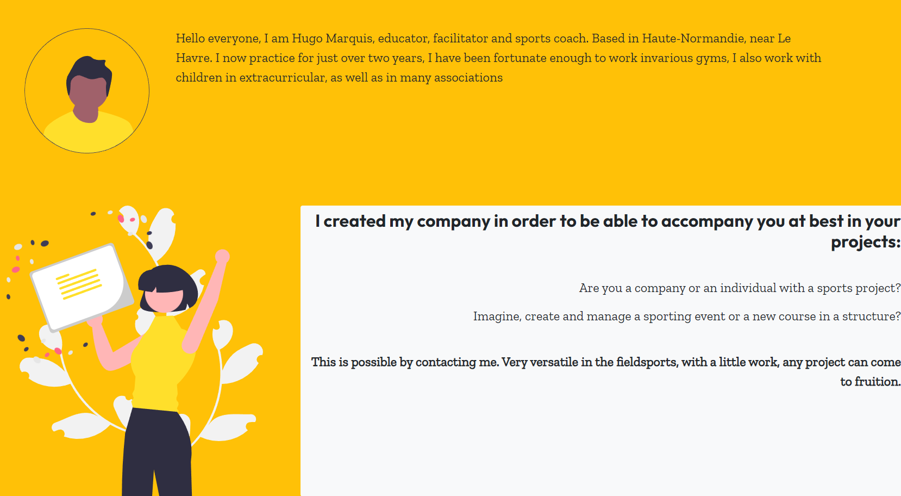
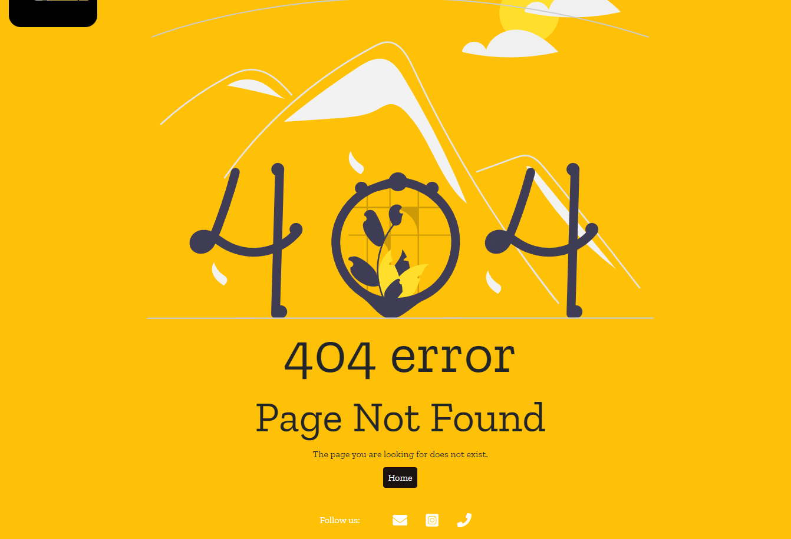

# Table of Contents

- [User Story Testing](#user-story-testing)
- [Code Validation](#code-validation)
  - [HTML](#html)
  - [CSS](#css)
  - [JavaScript](#JavaScript)
  - [Python](#python)
- [Responsiveness](#Responsiveness)
- [Browser Testing](#browser-testing)
- [Device Testing](#device-testing)
- [Lighthouse](#Lighthouse)
- [Manual Testing](#manual-testing)

  - [Site Navigation](#site-navigation)
  - [Home Page](#home-page)
  - [Category Page](#category-page)
  - [Article Preview Card](#article-preview-card)
  - [Post Detail Page](#post-detail-page)
  - [Comment](#comment)
  - [Add Post Page](#add-post-page)
  - [Edit Post Page](#edit-post-page)
  - [Delete Confirmation Modal](#delete-confirmation-modal)
  - [Profile Page](#profile-page)
  - [Update Profile Page](#update-profile-page)
  - [Sign Up Page](#sign-up-page)
  - [Sign In Page](#sign-in-page)
  - [Log Out Page](#log-out-page)
  - [Code of Conduct Page](#code-of-conduct-page)

- [Bugs](#bugs)

## User Story Testing

| User Story                                                                                                                                                                                                                        | Screenshot                                                                                                                                                                                              | Result           |
| --------------------------------------------------------------------------------------------------------------------------------------------------------------------------------------------------------------------------------- | ------------------------------------------------------------------------------------------------------------------------------------------------------------------------------------------------------- | ---------------- |
| As a developer I can setup a new Django project so that I can create the project's structure | The project was set up successfully | <mark>PASS<mark> |
| As a developer I can connect database and media storage so that the user's stored data is stored successfully | Database and storage set up succesfully | <mark>PASS<mark> |
| As a developer, I can perform an early deployment of the application to verify the functionality of the initial setup so that I can continue testing the application as it evolves during development. | Live site was hosted with no errors | <mark>PASS<mark> |
| As a developer I can layout wireframes so that I have a clear idea of the sites structure and theme | Wireframers were planned and created as referenced in the [README](./README.md) | <mark>PASS<mark> |
| As a developer I can choose a colour theme so that all pages have a consistent feel and style. | A colour theme was chosen for the website as referenced in the [README](./README.md) | <mark>PASS<mark> |
| As a User I want the website to be responsive so I can view it on multiple devices | 

Responsive

 | <mark>PASS<mark> |
| As a User I can intuitively navigate through the website so that I can view all content with ease. | 

Navigation Bar

 | <mark>PASS<mark> |
| As a User, I can create an account so that I can post, save and edit content | 

Registration

 | <mark>PASS<mark> |
| As a User, I can log out so that I can secure my account from potential hacks | 

Sign Out

 | <mark>PASS<mark> |
| As a User, I can see the differents availaibilities of the coach easily. | 

Calendar

 | <mark>PASS<mark> |
| As a User, I can book a private session with the coach easily through the website | 

Book a Private Session

 | <mark>PASS<mark> |
| As a User, I can join a class added by the coach. | 

Join Course 

 | <mark>PASS<mark> |
| As a Site Owner , I can create classes , and add my unavailabilities on the calendar| 

Adding Classes/Unavailabilities

 | <mark>PASS<mark> |
| As a Site Owner, I can approve ,or delete the private sessions booked by my customers | 

Approve/Delete

 | <mark>PASS<mark> |
| As a User, I can only see the details of my own private sessions or of the classes of the coach, to respect the privacy of everyone. | 

Privacy

 | <mark>PASS<mark> |
| As a Site owner, I can see the number of participants for my classes.| 

Number participants

 | <mark>PASS<mark> |
| As a Site Owner, I can make sure my clients stays inform about any modifications on the classes, or private sessions, by sending them automated emails.| 

Automated Emails

 | <mark>PASS<mark> |
| As a User, I can contact the Site Owner by sending a message through the Contact Form.| 

Contact Form

 | <mark>PASS<mark> |
| As a User, I can post a comment so that I can share my insights with the community. | 

Add Post

 | <mark>PASS<mark> |
| As a User, I can view content on the home page so that I can stay informed and explore engaging topics. | 

Home Page

 | <mark>PASS<mark> 
| As a User, I can view a selected article with its comments, so that I can explore in-depth content and engage with the community. | 

News Detail Page

 | <mark>PASS<mark> |
| As a User, I can view articles so that I can explore content that interests me. | 

News Page

 | <mark>PASS<mark> |
| As a Developer, I can created a standardised article preview card for each article, providing key information at a glance so that users can quickly understand the context of an article | 

Article Card

 | <mark>PASS<mark> |
| As a Site Owner, I can have the capability to perform all CRUD (Create, Read, Update, Delete) functionality within the website's admin interface so that I can manually create and edit content. | 

Admin Crud

 | <mark>PASS<mark> |
| As a User I can see notification messages when performing CRUD operations or login/logout, signup so that informed about the outcome of the action taken. | 

Notifications

 | <mark>PASS<mark> |
| As a User, I can comment and like an article posted by the Site Owner to share with him and the community.| 

Comments/Likes

 | <mark>PASS<mark> |
| As a User, I want to view comments on an article so that I can see the discussions going on a particular topic. | 

Comments

 | <mark>PASS<mark> |
| As a Developer, I want to ensure the styling and theme of the website are consistent, free from CSS errors, and provide an intuitive and easy-to-use UI/UX so that users easily digest content and perform all actions with ease. | 

Website theme

 | <mark>PASS<mark> |
| As a developer, I can show custom error pages redirect the user to the home page, so that I have a consistent experience even when encountering errors on the website. | 

Error Page

 | <mark>PASS<mark> |
| As a User, I can click on the footer contact social links so I can find out more information about the brand | 

Footer

 | <mark>PASS<mark> |

## Code Validation

### HTML

All HTML pages were run through the [W3C HTML Validator](https://validator.w3.org/). See results in below table.

| Page            | Validator                                                                                                                             | Result              |
| --------------- | ------------------------------------------------------------------------------------------------------------------------------------- | ------------------- |
| Home            | 

Home Page

                       | <mark>PASS</mark>   |
| News        | 

News Page

               | <mark>PASS</mark>   |
| News Detail     | 

News Detail Page

            | <mark>PASS</mark>   |
| Add News        | 

Add News Page

               | <mark>PASS</mark> |
| Bookings        | 

Bookings Page

                 | <mark>PASS</mark>   |
| Booking Course details    | 

Bookings Course details

 | <mark>PASS</mark> |
| Creating a Course    | 

Creating a course

 | <mark>PASS</mark> |
| Creating a Private Session    | 

Creating a Private Session

 | <mark>PASS</mark> |
| Unavailability    | 

Unavailability

 | <mark>PASS</mark> |
| Unavailability Creation   | 

Unavailability Creation

 | <mark>PASS</mark> |
| Sign In         | 

Sign In

                        | <mark>PASS</mark>   |
| Sign Up         | 

Sign Up

                       | <mark>Errors</mark>   |
| Log out         | 

Log Out

                       | <mark>PASS</mark>   |
| Contact         | 

Contact

                       | <mark>PASS</mark>   |

The HTML validation errors are attributed to the integration of allAuth. These errors, while minor, are challenging to address without uninstalling this package. Given functionality remains as intended and this package provide significant value, functionality and usability is prioritised over resolving these specific HTML validation issues.

### CSS

Test Results CSS <mark>PASS<mark>

### JavaScript

I used Javascript for different cases. I used it to render the calendar with dynamics events, to change dynamically the size of the font on the articles, to allow users to join a course and finally to retrieve the dates and time when users clicks on a date in the calendar.

calendar.js:

dynamicFont.js:

join_course.js:

retrieve_date.js:
JS Hint didn't work when I gave the code of that file . 

### Python
#### Calendar
| File     | Validator                                                                                                              | Result            |
| -------- | ---------------------------------------------------------------------------------------------------------------------- | ----------------- |
| Models   | 

Models

     | <mark>PASS</mark> |
| Views    | 

Views

       | <mark>PASS</mark> |
| Forms    | 

Forms

       | <mark>PASS</mark> |
| Urls     | 

Urls

      | <mark>PASS</mark> |
| Admin    | 

Admin

       | <mark>PASS</mark> |
| Utils    | 

Utils

       | <mark>PASS</mark> |

#### Blog

| File     | Validator                                                                                                              | Result            |
| -------- | ---------------------------------------------------------------------------------------------------------------------- | ----------------- |
| Models   | 

Models

     | <mark>PASS</mark> |
| Views    | 

Views

       | <mark>PASS</mark> |
| Forms    | 

Forms

       | <mark>PASS</mark> |
| Urls     | 

Urls

      | <mark>PASS</mark> |
| Admin    | 

Admin

       | <mark>PASS</mark> |

#### General Website
| File     | Validator                                                                                                              | Result            |
| -------- | ---------------------------------------------------------------------------------------------------------------------- | ----------------- |
| Contact Form   | 

Models

     | <mark>PASS</mark> |
| Settings    | 

Views

       | <mark>PASS</mark> |
| Urls    | 

Forms

       | <mark>PASS</mark> |
| Views    | 

Urls

      | <mark>PASS</mark> |

Settings.py validation errors of line to line are as a result of the original django configuration set up and not custom code.

## Responsiveness

Throughout the development process, each page underwent testing using Google Chrome's developer tools. The approach focused on verifying that every page would seamlessly adjust to a variety of screen sizes wider than 320px, rather than being limited by predetermined, device-specific widths.

Further testing was done on a real mobile device to confirm all is working as expected.

| Device         |     Pass/Fail     |               Comment                |
| -------------- | :---------------: | :----------------------------------: |
| Google Pixel 6 | <mark>PASS</mark> | All elements are displayed correctly |

## Browser Testing

The Website was tested on Google Chrome, Firefox, Safari and Chrome Canary browsers with no issues noted.

## Device Testing

The website was tested on a variety of devices, including Desktop, Laptop, Huawei P30 Pro, and Samsung tablet, to ensure that it displayed well on screens of different sizes, both in portrait and landscape orientations. The website functioned as expected, and its responsive design was validated using Chrome developer tools on various devices, ensuring that the layout remained structurally sound across different screen dimensions.

### Lighthouse

Lighthouse validation was run on all pages (both mobile and desktop) in order to check accessibility and performance.

| Page            | Performance | Accessibility | Best Practices | SEO | Screenshot                                                                                                                  |
| --------------- | :---------: | :-----------: | :------------: | :-: | --------------------------------------------------------------------------------------------------------------------------- |
|                 |             |               |                |     |
| **Desktop**     |             |               |                |     |
| Home            |     98      |      100      |      100       | 100 | 

Home

                    |
| Category        |     98      |      100      |      100       | 100 | 

Category

            |
| Post Detail     |     97      |      100      |      100       | 100 | 

Post Detail 

      |
| Profile         |     96      |      100      |      100       | 100 | 

Profile

              |
| Add Post        |     99      |      96       |      100       | 100 | 

Add Post

             |
| Edit Post       |     99      |      96       |      100       | 100 | 

Edit Post

           |
| Update Profile  |     100     |      100      |      100       | 100 | 

Update Profile

 |
| Sign Up         |     99      |      100      |      100       | 100 | 

Sign Up

               |
| Sign In         |     100     |      100      |      100       | 100 | 

Sign In

               |
| Sign Out        |     100     |      100      |      100       | 100 | 

Sign Out

             |
| Code of Conduct |     100     |      100      |      100       | 100 | 

Sign Out

       |
|                 |             |               |                |     |
| **Mobile**      |             |               |                |     |
| Home            |     90      |      100      |      100       | 100 | 

Home

                     |
| Category        |     91      |      100      |      100       | 100 | 

Category

             |
| Post Detail     |     95      |      100      |      100       | 100 | 

Post Detail

        |
| Profile         |     90      |      100      |      100       | 100 | 

Profile

               |
| Add Post        |     86      |      95       |      100       | 100 | 

Add Post

              |
| Edit Post       |     87      |      95       |      100       | 100 | 

Edit Post

           |
| Update Profile  |     98      |      100      |      100       | 100 | 

Update Profile

  |
| Sign Up         |     98      |      100      |      100       | 100 | 

Sign Up

                |
| Sign In         |     99      |      100      |      100       | 100 | 

Sign In

                |
| Sign Out        |     98      |      100      |      100       | 100 | 

Sign Out

              |
| Code of Conduct |     98      |      100      |      100       | 100 | 

Sign Out

         |

Lighthouse Iframe summernote widget error. This error dropped the accessibilty score of some pages and was due to the summernote external package. The error was left unresolved.

IFrame Error

## Manual Testing

### Site Navigation

| Element                | Action      | Expected Result                                         | Pass/Fail         |
| ---------------------- | ----------- | ------------------------------------------------------- | ----------------- |
| Logo                   | Click       | Redirect to Home page                                   | <mark>Pass</mark> |
| Home Link              | Click       | Redirect to Home page                                   | <mark>Pass</mark> |
| Category Button        | Click       | Render a dropdown menu of all categories                | <mark>Pass</mark> |
| Category Dropdown Link | Click       | Redirect to selected category page                      | <mark>Pass</mark> |
| Add Post Link          | Click       | Redirect to selected add post page                      | <mark>Pass</mark> |
| Register Link          | Click       | Redirect to sign up page                                | <mark>Pass</mark> |
| Log in Link            | Click       | Redirect to sign in page                                | <mark>Pass</mark> |
| Log out Link           | Click       | Redirect to log out page                                | <mark>Pass</mark> |
| Profile Link           | Click       | Redirect to profile page                                | <mark>Pass</mark> |
| Hamburger Menu         | Click       | Render a dropdown menu of all links                     | <mark>Pass</mark> |
| Footer Socials         | Click       | Redirect in a new tab to all respective media platforms | <mark>Pass</mark> |
| Code of Conduct Link   | Click       | Redirect to code of conduct page                        | <mark>Pass</mark> |
| Footer Email           | Click       | Open up an email provider with developer email attached | <mark>Pass</mark> |
| Register Link          | Display     | Render for non authenticated users                      | <mark>Pass</mark> |
| Log in Link            | Display     | Render for non authenticated users                      | <mark>Pass</mark> |
| Add Post Link          | Display     | Render only if user is authenticated                    | <mark>Pass</mark> |
| Log out Link           | Display     | Render only if user is authenticated                    | <mark>Pass</mark> |
| Profile Link           | Display     | Render only if user is authenticated                    | <mark>Pass</mark> |
| Nav Link               | Hover/Focus | Display a green underline border, lighten text          | <mark>Pass</mark> |
| Footer Socials         | Hover/Focus | Provide background colour feedback change               | <mark>Pass</mark> |
| Code of Conduct Link   | Hover/Focus | Text darken                                             | <mark>Pass</mark> |

### Home Page

| Element          | Action      | Expected Result                          | Pass/Fail         |
| ---------------- | ----------- | ---------------------------------------- | ----------------- |
| Category Widgets | Click       | Redirect to selected category page       | <mark>Pass</mark> |
| Editors Pick     | Display     | Editors Pick Post Card viewable          | <mark>Pass</mark> |
| Trending         | Display     | Trending Post Snippets viewable          | <mark>Pass</mark> |
| Popular Post     | Display     | Popular Post Post Card viewable          | <mark>Pass</mark> |
| Category Widgets | Hover/Focus | Background turns green, text turns white | <mark>Pass</mark> |

### Category Page

| Element          | Action      | Expected Result                                               | Pass/Fail         |
| ---------------- | ----------- | ------------------------------------------------------------- | ----------------- |
| Category Widgets | Click       | Redirect to selected category page                            | <mark>Pass</mark> |
| Article Cards    | Display     | All Category Post Cards Rendered in grid layout               | <mark>Pass</mark> |
| Article Cards    | Pagination  | Pagination occurs on over 6 cards to a page                   | <mark>Pass</mark> |
| Paginator        | Click       | All navigations buttons redirect to correct paginated results | <mark>Pass</mark> |
| Category Widgets | Hover/Focus | Background turns green, text turns white                      | <mark>Pass</mark> |

### Article Preview Card

| Element        | Action      | Expected Result                                    | Pass/Fail         |
| -------------- | ----------- | -------------------------------------------------- | ----------------- |
| Content        | Display     | Render the article title, excerpt, author and date | <mark>Pass</mark> |
| Statistics     | Display     | Render the amount of likes, comments and category  | <mark>Pass</mark> |
| Title Link     | Click       | Redirect to post detail page                       | <mark>Pass</mark> |
| Explore Button | Click       | Redirect to post detail page                       | <mark>Pass</mark> |
| Author Link    | Click       | Redirect to authors profile page                   | <mark>Pass</mark> |
| Edit Button    | Click       | Redirect to edit post page                         | <mark>Pass</mark> |
| Edit Button    | Display     | Render for only authneticated post author          | <mark>Pass</mark> |
| Title Link     | Hover/Focus | Darken Text                                        | <mark>Pass</mark> |
| Author Link    | Hover/Focus | Darken Text                                        | <mark>Pass</mark> |
| Explore Button | Hover/Focus | Background blue, text white                        | <mark>Pass</mark> |
| Edit Button    | Hover/Focus | Darken Background                                  | <mark>Pass</mark> |

### Pending Preview Card

| Element     | Action      | Expected Result                                    | Pass/Fail         |
| ----------- | ----------- | -------------------------------------------------- | ----------------- |
| Edit Button | Display     | Render for only authneticated post author          | <mark>Pass</mark> |
| Content     | Display     | Render the article title, excerpt, author and date | <mark>Pass</mark> |
| Edit Button | Click       | Redirect to edit post page                         | <mark>Pass</mark> |
| Edit Button | Hover/Focus | Darken Background                                  | <mark>Pass</mark> |

### Post Detail Page

| Element               | Action      | Expected Result                                     | Pass/Fail         |
| --------------------- | ----------- | --------------------------------------------------- | ----------------- |
| Article               | Display     | The articles title/content and author are displayed | <mark>Pass</mark> |
| Author Link           | Click       | Redirect to authors profile page                    | <mark>Pass</mark> |
| Edit Button           | Click       | Redirect to edit post page                          | <mark>Pass</mark> |
| Edit Button           | Display     | Render for only authneticated post author           | <mark>Pass</mark> |
| Like Button           | Display     | Render Thumbs up toggle if authenticated            | <mark>Pass</mark> |
| Like Button           | Display     | If Liked render a blue thumbs up button             | <mark>Pass</mark> |
| Like Button           | Display     | If not liked render an outliked thumbs up button    | <mark>Pass</mark> |
| Like Button           | Click       | Toggle the users liked status in the database       | <mark>Pass</mark> |
| Like Button           | Click       | Refresh the page with the current like status       | <mark>Pass</mark> |
| Heart Button          | Display     | Render if user is not authenicated                  | <mark>Pass</mark> |
| Heart Button          | Click       | Redirected user to sign in page                     | <mark>Pass</mark> |
| Likes Count           | Display     | Display the total amount of likes of the article    | <mark>Pass</mark> |
| Comments              | Display     | Render All Comments                                 | <mark>Pass</mark> |
| Comment Form          | Display     | Render Comment Form to authenticated users          | <mark>Pass</mark> |
| Comment Form(Valid)   | Submit      | Post the comment to the post detail page            | <mark>Pass</mark> |
| Comment Form(Valid)   | Submit      | Toast notification displayed                        | <mark>Pass</mark> |
| Comment Form(Invalid) | Submit      | Render error context to the UI                      | <mark>Pass</mark> |
| Comment Form(Invalid) | Submit      | Toast error notification displayed                  | <mark>Pass</mark> |
| Comment Form Login    | Display     | Render login button to non authenticated users      | <mark>Pass</mark> |
| Comment Form Login    | Click       | Redirected user to sign in page                     | <mark>Pass</mark> |
| Popular Posts         | Display     | 3 popular posts of the same category are displayed  | <mark>Pass</mark> |
| Like Button           | Hover/Focus | Darken Text and increase scale                      | <mark>Pass</mark> |
| Heart Button          | Hover/Focus | Increase scale                                      | <mark>Pass</mark> |
| Author Link           | Hover/Focus | Darken Text                                         | <mark>Pass</mark> |
| Edit Button           | Hover/Focus | Darken Background                                   | <mark>Pass</mark> |
| Like Button           | Hover/Focus | Cursor Pointer                                      | <mark>Pass</mark> |
| Comment Submit Button | Hover/Focus | Darken Background                                   | <mark>Pass</mark> |

### Comment

| Element       | Action      | Expected Result                             | Pass/Fail         |
| ------------- | ----------- | ------------------------------------------- | ----------------- |
| Comment       | Display     | Render the comment content, author and date | <mark>Pass</mark> |
| Author Link   | Click       | Redirect to authors profile page            | <mark>Pass</mark> |
| Author Icon   | Click       | Redirect to authors profile page            | <mark>Pass</mark> |
| Delete Button | Display     | Render if authenticated author              | <mark>Pass</mark> |
| Delete Button | Click       | Delete Confirmation Modal appears           | <mark>Pass</mark> |
| Author Link   | Hover/Focus | Darken Text                                 | <mark>Pass</mark> |
| Delete Button | Hover/Focus | Darken Background                           | <mark>Pass</mark> |

### Add Post Page

| Element               | Action         | Expected Result                                    | Pass/Fail         |
| --------------------- | -------------- | -------------------------------------------------- | ----------------- |
| Page                  | Authentication | Unauthneticated users routed to sign in page       | <mark>Pass</mark> |
| Text Input Required   | None           | On Submit: Warning appears, form won't submit      | <mark>Pass</mark> |
| Image Input           | Click          | Open device file storage                           | <mark>Pass</mark> |
| Image Input           | Selected       | Display selected image name                        | <mark>Pass</mark> |
| Image Input           | None           | Placeholder image selected                         | <mark>Pass</mark> |
| Submit Input(Invalid) | Click          | Form is not submitted and error messages appear    | <mark>Pass</mark> |
| Submit Input(Invalid) | Click          | Toast notification error message appears           | <mark>Pass</mark> |
| Submit Input(Valid)   | Click          | Form is submitted and notification message appears | <mark>Pass</mark> |
| Submit Input(Valid)   | Click          | User is redirected to home page                    | <mark>Pass</mark> |
| Submit Input(Valid)   | Submit         | Post sent to DB for approval                       | <mark>Pass</mark> |
| Post Title            | Submit         | No duplicated titles are allowed                   | <mark>Pass</mark> |
| Error Context         | Submit         | If user forces submit error contexts are displayed | <mark>Pass</mark> |
| Submit Button         | Hover/Focus    | Darken Background                                  | <mark>Pass</mark> |

### Edit Post Page

| Element               | Action         | Expected Result                                    | Pass/Fail         |
| --------------------- | -------------- | -------------------------------------------------- | ----------------- |
| Page                  | Authentication | Unauthneticated users routed to sign in page       | <mark>Pass</mark> |
| Page                  | Authentication | Non Authour users show 403 page                    | <mark>Pass</mark> |
| Page                  | Display        | Post content is rendered to the UI                 | <mark>Pass</mark> |
| Text Input Required   | None           | On Submit: Warning appears, form won't submit      | <mark>Pass</mark> |
| Image Input           | Click          | Open device file storage                           | <mark>Pass</mark> |
| Image Input           | Selected       | Display selected image name                        | <mark>Pass</mark> |
| Image Input           | None           | Current image selected                             | <mark>Pass</mark> |
| Current Image         | None           | Current image link is displayed                    | <mark>Pass</mark> |
| Current Image         | Click          | Redirected to image display                        | <mark>Pass</mark> |
| Submit Input(Invalid) | Click          | Form is not submitted and error messages appear    | <mark>Pass</mark> |
| Submit Input(Invalid) | Click          | Toast notification error message appears           | <mark>Pass</mark> |
| Submit Input(Valid)   | Click          | Form is submitted and notification message appears | <mark>Pass</mark> |
| Submit Input(Valid)   | Click          | User is redirected to home page                    | <mark>Pass</mark> |
| Submit Input(Valid)   | Submit         | Post sent to DB for approval                       | <mark>Pass</mark> |
| Delete Button         | Click          | Delete Confirmation Modal appears                  | <mark>Pass</mark> |
| Post Title            | Submit         | No duplicated titles are allowed                   | <mark>Pass</mark> |
| Error Context         | Submit         | If user forces submit error contexts are displayed | <mark>Pass</mark> |
| Submit Button         | Hover/Focus    | Darken Background                                  | <mark>Pass</mark> |
| Delete Button         | Hover/Focus    | Darken Background                                  | <mark>Pass</mark> |

### Delete Confirmation Modal

| Element               | Action      | Expected Result                       | Pass/Fail         |
| --------------------- | ----------- | ------------------------------------- | ----------------- |
| Close Button          | Click       | Modal and opacic background disappear | <mark>Pass</mark> |
| Confirm Delete Button | Click       | Context item is delete from database  | <mark>Pass</mark> |
| Close Button          | Hover/Focus | Darken Background                     | <mark>Pass</mark> |
| Confirm Delete Button | Hover/Focus | Darken Background                     | <mark>Pass</mark> |

### Profile Page

| Element               | Action      | Expected Result                                               | Pass/Fail         |
| --------------------- | ----------- | ------------------------------------------------------------- | ----------------- |
| Page                  | Display     | All User Profile Details Rendered                             | <mark>Pass</mark> |
| Settings Button       | Click       | Redirect to update profile page                               | <mark>Pass</mark> |
| Settings Button       | Display     | Render only if authenticated user is the profile page owner   | <mark>Pass</mark> |
| Settings Button       | Hover/Focus | Lighten Background                                            | <mark>Pass</mark> |
| Add Post Button       | Click       | Redirect to add post page                                     | <mark>Pass</mark> |
| Add Post Button       | Display     | Render only if authenticated user is the profile page owner   | <mark>Pass</mark> |
| Add Post Button       | Display     | Render only if no posts                                       | <mark>Pass</mark> |
| Add Post Button       | Hover/Focus | Lighten Background                                            | <mark>Pass</mark> |
| Add Favourites Button | Click       | Redirect to home page                                         | <mark>Pass</mark> |
| Add Favourites Button | Display     | Render only if authenticated user is the profile page owner   | <mark>Pass</mark> |
| Add Favourites Button | Display     | Render only if no favourites                                  | <mark>Pass</mark> |
| Add Favourites Button | Hover/Focus | Lighten Background                                            | <mark>Pass</mark> |
| Statistics            | Display     | All User Statisitics Details Rendered                         | <mark>Pass</mark> |
| Pending Posts         | Display     | Render all pending posts if authneticated author              | <mark>Pass</mark> |
| User Posts            | Display     | All User Posts Rendered                                       | <mark>Pass</mark> |
| User Favourites       | Display     | All User Favourites Rendered                                  | <mark>Pass</mark> |
| User Posts            | Pagination  | Pagination occurs on over 4 cards to a list                   | <mark>Pass</mark> |
| User Favourites       | Pagination  | Pagination occurs on over 4 cards to a list                   | <mark>Pass</mark> |
| Posts Paginator       | Click       | All navigations buttons redirect to correct paginated results | <mark>Pass</mark> |
| Favourites Paginator  | Click       | All navigations buttons redirect to correct paginated results | <mark>Pass</mark> |
| Posts                 | Display     | If no post render No Posts UI                                 | <mark>Pass</mark> |
| Favourites            | Display     | If no favourites render No Favourites UI                      | <mark>Pass</mark> |
| Article Cards         | Links       | All rendered Article Cards are correctly linked               | <mark>Pass</mark> |
| Pending Cards Edit    | Links       | All rendered Pending Cards Edit buttons are correctly linked  | <mark>Pass</mark> |

### Update Profile Page

| Element                   | Action         | Expected Result                               | Pass/Fail         |
| ------------------------- | -------------- | --------------------------------------------- | ----------------- |
| Page                      | Authentication | Unauthneticated users routed to sign in page  | <mark>Pass</mark> |
| Page                      | Display        | User Information Rendered to Inputs           | <mark>Pass</mark> |
| Text Input Required       | None           | On Submit: Warning appears, form won't submit | <mark>Pass</mark> |
| Username Title            | Submit         | No duplicated usernames are allowed           | <mark>Pass</mark> |
| User Submit (Valid)       | Submit         | Information updated in database               | <mark>Pass</mark> |
| User Submit (Valid)       | Submit         | Toast notification message received           | <mark>Pass</mark> |
| User Submit (Valid)       | Submit         | Redirected to profile page                    | <mark>Pass</mark> |
| User Submit (Invalid)     | Submit         | Error context rendered to UI                  | <mark>Pass</mark> |
| User Submit (Invalid)     | Submit         | Toast notification error message received     | <mark>Pass</mark> |
| Bio Submit (Valid)        | Submit         | Information updated in database               | <mark>Pass</mark> |
| Bio Submit (Valid)        | Submit         | Toast notification message received           | <mark>Pass</mark> |
| Bio Submit (Valid)        | Submit         | Redirected to profile page                    | <mark>Pass</mark> |
| Bio Submit (Invalid)      | Submit         | Error context rendered to UI                  | <mark>Pass</mark> |
| Bio Submit (Invalid)      | Submit         | Toast notification error message received     | <mark>Pass</mark> |
| Password Submit (Valid)   | Submit         | Information updated in database               | <mark>Pass</mark> |
| Password Submit (Valid)   | Submit         | Toast notification message received           | <mark>Pass</mark> |
| Password Submit (Valid)   | Submit         | Redirected to profile page                    | <mark>Pass</mark> |
| Password Submit (Invalid) | Submit         | Error context rendered to UI                  | <mark>Pass</mark> |
| Password Submit (Invalid) | Submit         | Toast notification error message received     | <mark>Pass</mark> |
| Delete Account Button     | Click          | Delete confirmation modal displayed           | <mark>Pass</mark> |
| Update User Button        | Hover/Focus    | Darken Background                             | <mark>Pass</mark> |
| Update Bio Button         | Hover/Focus    | Darken Background                             | <mark>Pass</mark> |
| Update Password Button    | Hover/Focus    | Darken Background                             | <mark>Pass</mark> |
| Delete Account Button     | Hover/Focus    | Darken Background                             | <mark>Pass</mark> |

### Sign Up Page

| Element       | Action         | Expected Result                             | Pass/Fail         |
| ------------- | -------------- | ------------------------------------------- | ----------------- |
| Page          | Authentication | Authenticated users redirected to Home page | <mark>Pass</mark> |
| Form(Valid)   | Submit         | Redirected to Home page                     | <mark>Pass</mark> |
| Form(Valid)   | Submit         | Sign up in Notification received            | <mark>Pass</mark> |
| Form(Invalid) | Submit         | Error Context rendered to UI                | <mark>Pass</mark> |
| Form(Invalid) | Submit         | Error Notification received                 | <mark>Pass</mark> |
| Login Link    | Click          | Redirect to Login Page                      | <mark>Pass</mark> |
| Form Button   | Hover/Focus    | Darken Background                           | <mark>Pass</mark> |
| Login Link    | Hover/Focus    | Darken Text                                 | <mark>Pass</mark> |

### Sign In Page

| Element       | Action         | Expected Result                             | Pass/Fail         |
| ------------- | -------------- | ------------------------------------------- | ----------------- |
| Page          | Authentication | Authenticated users redirected to Home page | <mark>Pass</mark> |
| Form(Valid)   | Submit         | Redirected to Home page                     | <mark>Pass</mark> |
| Form(Valid)   | Submit         | Sign up in Notification received            | <mark>Pass</mark> |
| Form(Invalid) | Submit         | Error Context rendered to UI                | <mark>Pass</mark> |
| Form(Invalid) | Submit         | Error Notification received                 | <mark>Pass</mark> |
| Register Link | Click          | Redirect to Sign In Page                    | <mark>Pass</mark> |
| Form Button   | Hover/Focus    | Darken Background                           | <mark>Pass</mark> |
| Register Link | Hover/Focus    | Darken Text                                 | <mark>Pass</mark> |

### Log Out Page

| Element       | Action         | Expected Result                                | Pass/Fail         |
| ------------- | -------------- | ---------------------------------------------- | ----------------- |
| Page          | Authentication | Un-authenticated users redirected to Home page | <mark>Pass</mark> |
| Logout Button | Click          | User session is Logged out                     | <mark>Pass</mark> |
| Logout Button | Click          | Redirected to Home page                        | <mark>Pass</mark> |
| Form Button   | Hover/Focus    | Darken Background                              | <mark>Pass</mark> |

### Code of Conduct Page

| Element | Action | Expected Result                                   | Pass/Fail         |
| ------- | ------ | ------------------------------------------------- | ----------------- |
| Page    | Dispay | All context is displayed correctly and responsive | <mark>Pass</mark> |

## Bugs

| Bug                                                                                                                        | Status |
| -------------------------------------------------------------------------------------------------------------------------- | ------ |
| [Profile routing based on slug errors #31](https://github.com/DarrachBarneveld/CoolCoders-PP4/issues/31)                   | Closed |
| [UpdateView Profile throwing errors with multiple forms #32](https://github.com/DarrachBarneveld/CoolCoders-PP4/issues/32) | Closed |
| [Content creating widget not responsive #37](https://github.com/DarrachBarneveld/CoolCoders-PP4/issues/37)                 | Closed |
| [Pagination on profile page renders only first results #38](https://github.com/DarrachBarneveld/CoolCoders-PP4/issues/38)  | Closed |
| [Lighthouse Performance Scores #41](https://github.com/DarrachBarneveld/CoolCoders-PP4/issues/41)                          | Closed |
| [User Edit Profile Form Autofocus #42](https://github.com/DarrachBarneveld/CoolCoders-PP4/issues/42)                       | Closed |
| [UX/UI Final Sweep #44](https://github.com/DarrachBarneveld/CoolCoders-PP4/issues/44)                                      | Closed |
| [Refresh Routing on changed Username #47](https://github.com/DarrachBarneveld/CoolCoders-PP4/issues/47)                    | Open   |
| [Env File not properly ignored #54](https://github.com/DarrachBarneveld/CoolCoders-PP4/issues/54)                          | Open   |
| [User Account Updated #55](https://github.com/DarrachBarneveld/CoolCoders-PP4/issues/55)                                   | Closed |
