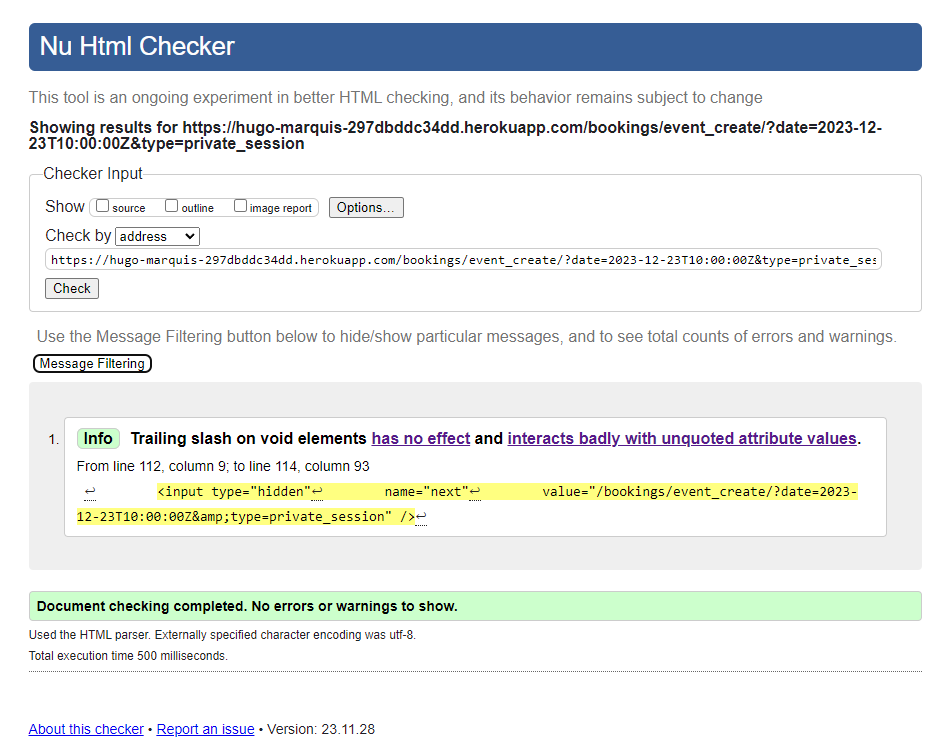
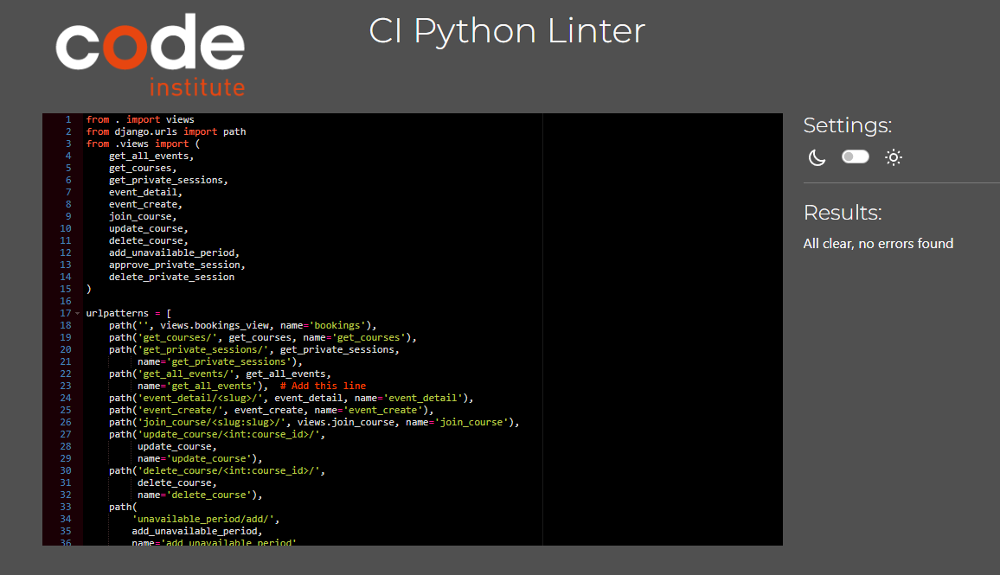
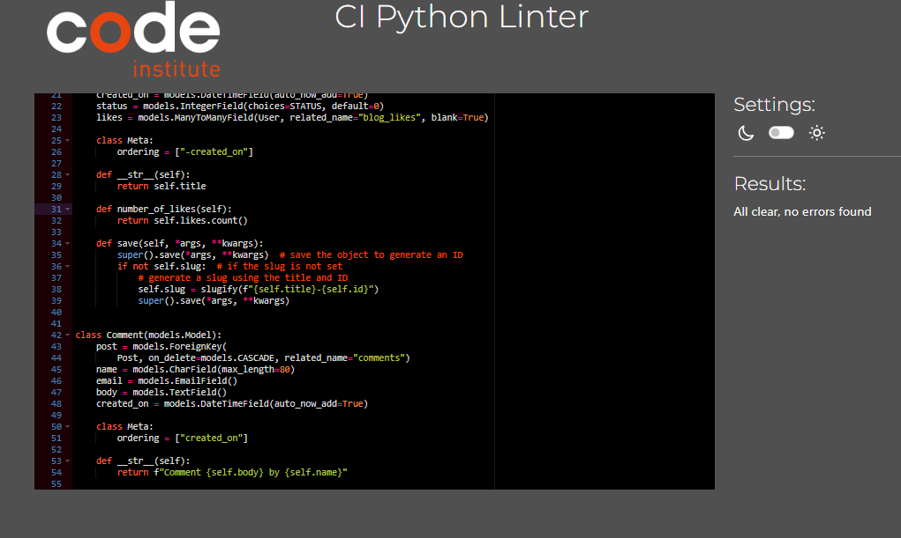
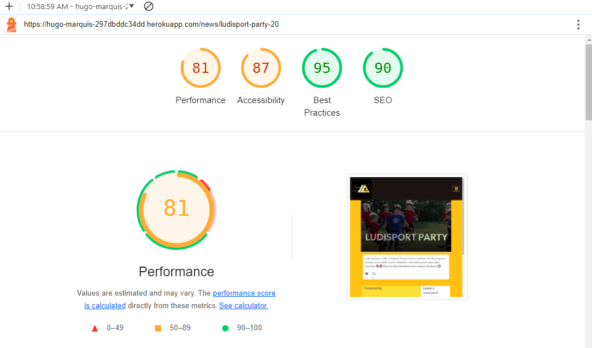
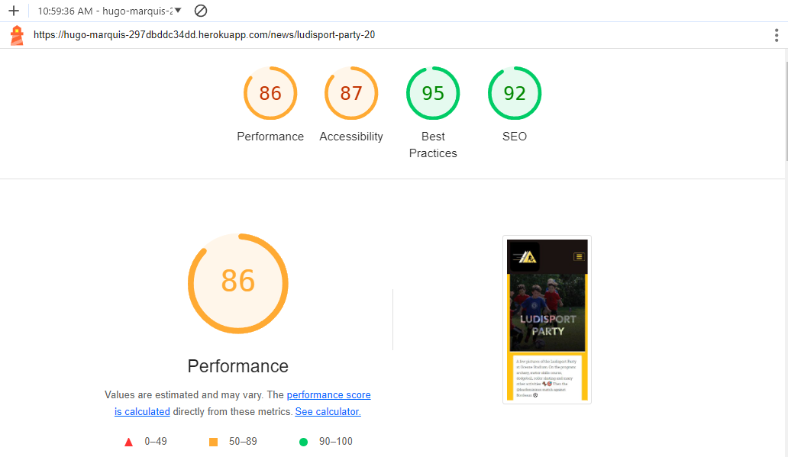

# Table of Contents

- [User Story Testing](#user-story-testing)
- [Code Validation](#code-validation)
  - [HTML](#html)
  - [CSS](#css)
  - [JavaScript](#JavaScript)
  - [Python](#python)
- [Responsiveness](#Responsiveness)
- [Browser Testing](#browser-testing)
- [Device Testing](#device-testing)
- [Lighthouse](#Lighthouse)
- [Manual Testing](#manual-testing)

  - [Site Navigation](#site-navigation)
  - [Home Page](#home-page)
  - [News Page](#news-page)
  - [News Details Card](#news-details-page)
  - [Add News Page](#add-news-page)
  - [Bookings Page](#bookings-page)
  - [Add Course Page](#add-course-page)
  - [Update Course Page](#update-course-page)
  - [Add Unavailable Period Page](#add-unavailable-period-page)
  - [Add Private Session Page](#add-private-session-page)
  - [Event Details Page](#event-details-page)
  - [Private Session from someone else Page](#private-session-from-someone-else-page)
  - [Unavailable Page](#unavailable)
  - [Sign Up Page](#sign-up-page)
  - [Sign In Page](#sign-in-page)
  - [Log Out Page](#log-out-page)
  - [Code of Conduct Page](#code-of-conduct-page)

- [Bugs](#bugs)

## User Story Testing

| User Story                                                                                                                                                                                                                        | Screenshot                                                                                                                                                                                              | Result           |
| --------------------------------------------------------------------------------------------------------------------------------------------------------------------------------------------------------------------------------- | ------------------------------------------------------------------------------------------------------------------------------------------------------------------------------------------------------- | ---------------- |
| As a developer I can setup a new Django project so that I can create the project's structure | The project was set up successfully | <mark>PASS<mark> |
| As a developer I can connect database and media storage so that the user's stored data is stored successfully | Database and storage set up succesfully | <mark>PASS<mark> |
| As a developer, I can perform an early deployment of the application to verify the functionality of the initial setup so that I can continue testing the application as it evolves during development. | Live site was hosted with no errors | <mark>PASS<mark> |
| As a developer I can layout wireframes so that I have a clear idea of the sites structure and theme | Wireframers were planned and created as referenced in the [README](./README.md) | <mark>PASS<mark> |
| As a developer I can choose a colour theme so that all pages have a consistent feel and style. | A colour theme was chosen for the website as referenced in the [README](./README.md) | <mark>PASS<mark> |
| As a User I want the website to be responsive so I can view it on multiple devices | 

Responsive

 | <mark>PASS<mark> |
| As a User I can intuitively navigate through the website so that I can view all content with ease. | 

Navigation Bar

 | <mark>PASS<mark> |
| As a User, I can create an account so that I can post, save and edit content | 

Registration

 | <mark>PASS<mark> |
| As a User, I can log out so that I can secure my account from potential hacks | 

Sign Out

 | <mark>PASS<mark> |
| As a User, I can see the differents availaibilities of the coach easily. | 

Calendar

 | <mark>PASS<mark> |
| As a User, I can book a private session with the coach easily through the website | 

Book a Private Session

 | <mark>PASS<mark> |
| As a User, I can join a class added by the coach. | 

Join Course 

 | <mark>PASS<mark> |
| As a Site Owner , I can create classes , and add my unavailabilities on the calendar| 

Adding Classes/Unavailabilities

 | <mark>PASS<mark> |
| As a Site Owner, I can approve ,or delete the private sessions booked by my customers | 

Approve/Delete

 | <mark>PASS<mark> |
| As a User, I can only see the details of my own private sessions or of the classes of the coach, to respect the privacy of everyone. | 

Privacy

 | <mark>PASS<mark> |
| As a Site owner, I can see the number of participants for my classes.| 

Number participants

 | <mark>PASS<mark> |
| As a Site Owner, I can make sure my clients stays inform about any modifications on the classes, or private sessions, by sending them automated emails.| 

Automated Emails

 | <mark>PASS<mark> |
| As a User, I can contact the Site Owner by sending a message through the Contact Form.| 

Contact Form

 | <mark>PASS<mark> |
| As a User, I can post a comment so that I can share my insights with the community. | 

Add Post

 | <mark>PASS<mark> |
| As a User, I can view content on the home page so that I can stay informed and explore engaging topics. | 

Home Page

 | <mark>PASS<mark> 
| As a User, I can view a selected article with its comments, so that I can explore in-depth content and engage with the community. | 

News Detail Page

 | <mark>PASS<mark> |
| As a User, I can view articles so that I can explore content that interests me. | 

News Page

 | <mark>PASS<mark> |
| As a Developer, I can created a standardised article preview card for each article, providing key information at a glance so that users can quickly understand the context of an article | 

Article Card

 | <mark>PASS<mark> |
| As a Site Owner, I can have the capability to perform all CRUD (Create, Read, Update, Delete) functionality within the website's admin interface so that I can manually create and edit content. | 

Admin Crud

 | <mark>PASS<mark> |
| As a User I can see notification messages when performing CRUD operations or login/logout, signup so that informed about the outcome of the action taken. | 

Notifications

 | <mark>PASS<mark> |
| As a User, I can comment and like an article posted by the Site Owner to share with him and the community.| 

Comments/Likes

 | <mark>PASS<mark> |
| As a User, I want to view comments on an article so that I can see the discussions going on a particular topic. | 

Comments

 | <mark>PASS<mark> |
| As a Developer, I want to ensure the styling and theme of the website are consistent, free from CSS errors, and provide an intuitive and easy-to-use UI/UX so that users easily digest content and perform all actions with ease. | 

Website theme

 | <mark>PASS<mark> |
| As a developer, I can show custom error pages redirect the user to the home page, so that I have a consistent experience even when encountering errors on the website. | 

Error Page

 | <mark>PASS<mark> |
| As a User, I can click on the footer contact social links so I can find out more information about the brand | 

Footer

 | <mark>PASS<mark> |

## Code Validation

### HTML

All HTML pages were run through the [W3C HTML Validator](https://validator.w3.org/). See results in below table.

| Page            | Validator                                                                                                                             | Result              |
| --------------- | ------------------------------------------------------------------------------------------------------------------------------------- | ------------------- |
| Home            | 

Home Page

                       | <mark>PASS</mark>   |
| News        | 

News Page

               | <mark>PASS</mark>   |
| News Detail     | 

News Detail Page

            | <mark>PASS</mark>   |
| Add News        | 

Add News Page

               | <mark>PASS</mark> |
| Bookings        | 

Bookings Page

                 | <mark>PASS</mark>   |
| Booking Course details    | 

Bookings Course details

 | <mark>PASS</mark> |
| Creating a Course    | 

Creating a course

 | <mark>PASS</mark> |
| Creating a Private Session    | 

Creating a Private Session

 | <mark>PASS</mark> |
| Unavailability    | 

Unavailability

 | <mark>PASS</mark> |
| Unavailability Creation   | 

Unavailability Creation

 | <mark>PASS</mark> |
| Sign In         | 

Sign In

                        | <mark>PASS</mark>   |
| Sign Up         | 

Sign Up

                       | <mark>Errors</mark>   |
| Log out         | 

Log Out

                       | <mark>PASS</mark>   |
| Contact         | 

Contact

                       | <mark>PASS</mark>   |

The HTML validation errors are attributed to the integration of allAuth. These errors, while minor, are challenging to address without uninstalling this package. Given functionality remains as intended and this package provide significant value, functionality and usability is prioritised over resolving these specific HTML validation issues.

### CSS

Test Results CSS <mark>PASS<mark>

### JavaScript

I used Javascript for different cases. I used it to render the calendar with dynamics events, to change dynamically the size of the font on the articles, to allow users to join a course and finally to retrieve the dates and time when users clicks on a date in the calendar.

calendar.js:

dynamicFont.js:

join_course.js:

retrieve_date.js:
JS Hint didn't work when I gave the code of that file . 

### Python
#### Calendar
| File     | Validator                                                                                                              | Result            |
| -------- | ---------------------------------------------------------------------------------------------------------------------- | ----------------- |
| Models   | 

Models

     | <mark>PASS</mark> |
| Views    | 

Views

       | <mark>PASS</mark> |
| Forms    | 

Forms

       | <mark>PASS</mark> |
| Urls     | 

Urls

      | <mark>PASS</mark> |
| Admin    | 

Admin

       | <mark>PASS</mark> |
| Utils    | 

Utils

       | <mark>PASS</mark> |

#### Blog

| File     | Validator                                                                                                              | Result            |
| -------- | ---------------------------------------------------------------------------------------------------------------------- | ----------------- |
| Models   | 

Models

     | <mark>PASS</mark> |
| Views    | 

Views

       | <mark>PASS</mark> |
| Forms    | 

Forms

       | <mark>PASS</mark> |
| Urls     | 

Urls

      | <mark>PASS</mark> |
| Admin    | 

Admin

       | <mark>PASS</mark> |

#### General Website
| File     | Validator                                                                                                              | Result            |
| -------- | ---------------------------------------------------------------------------------------------------------------------- | ----------------- |
| Contact Form   | 

Models

     | <mark>PASS</mark> |
| Settings    | 

Views

       | <mark>PASS</mark> |
| Urls    | 

Forms

       | <mark>PASS</mark> |
| Views    | 

Urls

      | <mark>PASS</mark> |

Settings.py validation errors of line to line are as a result of the original django configuration set up and not custom code.

## Responsiveness

Throughout the development process, each page underwent testing using Google Chrome's developer tools. The approach focused on verifying that every page would seamlessly adjust to a variety of screen sizes wider than 320px, rather than being limited by predetermined, device-specific widths.

Further testing was done on a real mobile device to confirm all is working as expected.

| Device         |     Pass/Fail     |               Comment                |
| -------------- | :---------------: | :----------------------------------: |
| Google Pixel 6 | <mark>PASS</mark> | All elements are displayed correctly |

## Browser Testing

The Website was tested on Google Chrome, Firefox, Safari and Chrome Canary browsers with no issues noted.

## Device Testing

The website was tested on a variety of devices, including Desktop, Laptop, Google Pixel 6, and Samsung tablet, to ensure that it displayed well on screens of different sizes, both in portrait and landscape orientations. The website functioned as expected, and its responsive design was validated using Chrome developer tools on various devices, ensuring that the layout remained structurally sound across different screen dimensions.

### Lighthouse

Lighthouse validation was run on all pages (both mobile and desktop) in order to check accessibility and performance.

| Page            | Performance | Accessibility | Best Practices | SEO | Screenshot                                                                                                                  |
| --------------- | :---------: | :-----------: | :------------: | :-: | --------------------------------------------------------------------------------------------------------------------------- |
|                 |             |               |                |     |
| **Desktop**     |             |               |                |     |
| Home            |     86      |      87      |      95       | 90 | 

Home

                    |
|News       |     96      |      89      |      95       | 90 | 

News

            |
| News Details     |     81      |      87      |      95       | 90 | 

News Details 

      |
| Add News         |     99      |      90      |      95       | 90 | 

Add News

              |
| Bookings        |     98      |      91       |      95       | 80 | 

Bookings

             |
| Event Details       |     88      |      89       |      95       | 90 | 

Event Details

           |
| Create Event  |     99     |      89      |      95       | 90 | 

Create Event

 |
| Update Class  |     99     |      89      |      95       | 90 | 

Update Class

 |
| Add Unavailability  |     99      |      89      |      95       | 90 | 

 Add Unavailability

               |
| Unavailable         |     79     |      89      |      95      | 90 | 

Unavailable

               |
| Contact        |     99     |      89      |      95       | 90 | 

Contact

             |
| Sign In |     98     |      90      |      95       | 90 | 

Sign In

       |
| Sign Up |     98     |      90      |      95       | 90 | 

Sign Up

       |
| Sign Out |    99      |      89      |      95       | 90 | 

Sign Out

       |
|                 |             |               |                |     |
| **Mobile**      |             |               |                |     |
| Home            |     68      |      87      |      95       | 92 | 

Home

                    |
|News       |     71      |      89      |      95       | 92 | 

News

            |
| News Details     |     86      |      87      |      95       | 92 | 

News Details 

      |
| Add News         |     91      |      90      |      95       | 92 | 

Add News

              |
| Bookings        |     92     |      91       |      95       | 83 | 

Bookings

             |
| Event Details       |     72      |      89       |      95       | 92 | 

Event Details

           |
| Create Event  |     91     |      89      |      95       | 92 | 

Create Event

 |
| Update Class  |     92     |      89      |      95       | 92 | 

Update Class

 |
| Add Unavailability         |     94      |      89      |      95       | 92 | 

 Add Unavailability

               |
| Unavailable         |     72     |      89      |      95       | 92 | 

Unavailable

               |
| Contact        |     91     |      89      |      95       | 92 | 

Contact

             |
| Sign In |     80     |      90      |      95       | 92 | 

Sign In

       |
| Sign Up |    77      |      90      |      95       | 92 | 

Sign Up

       |
| Sign Out |     82     |      89      |      95       | 92 | 

Sign Out

       |

## Manual Testing

### Site Navigation

| Element                | Action      | Expected Result                                         | Pass/Fail         |
| ---------------------- | ----------- | ------------------------------------------------------- | ----------------- |
| Logo                   | Click       | Redirect to Home page                                   | <mark>Pass</mark> |
| Home Link              | Click       | Redirect to Home page                                   | <mark>Pass</mark> |
| News Link        | Click       | Redirect to News                | <mark>Pass</mark> |
| Bookings Link          | Click       | Redirect to Bookings                      | <mark>Pass</mark> |
| Register Link          | Click       | Redirect to sign up page                                | <mark>Pass</mark> |
| Log in Link            | Click       | Redirect to sign in page                                | <mark>Pass</mark> |
| Log out Link           | Click       | Redirect to log out page                                | <mark>Pass</mark> |
| Contact Link           | Click       | Redirect to contact page                                | <mark>Pass</mark> |
| Language Dropdown           | Click       | Open dropdown menu to select language                                | <mark>Pass</mark> |
| Language links           | Click       | Change language of the website                                | <mark>Pass</mark> |
| Hamburger Menu         | Click       | Render a dropdown menu of all links                     | <mark>Pass</mark> |
| Footer Socials         | Click       | Redirect in a new tab to all respective media platforms | <mark>Pass</mark> |
| Footer Email           | Click       | Open up an email provider with coach email attached | <mark>Pass</mark> |
| Register Link          | Display     | Render for non authenticated users                      | <mark>Pass</mark> |
| Log in Link            | Display     | Render for non authenticated users                      | <mark>Pass</mark> |

### Home Page

| Element          | Action      | Expected Result                          | Pass/Fail         |
| ---------------- | ----------- | ---------------------------------------- | ----------------- |
| Link to last article            | Click     | Redirect to last article                      | <mark>Pass</mark> |
| Images            | Display     | Renders at the appropriate size                      | <mark>Pass</mark> |

### News Page

| Element          | Action      | Expected Result                                               | Pass/Fail         |
| ---------------- | ----------- | ------------------------------------------------------------- | ----------------- |
| Link to Article Details | Click       | Redirect to the selected article page                           | <mark>Pass</mark> |
| Add News button     | Click     | Only displayed for superuser and redirect to Add News Page | <mark>Pass</mark> |
| Likes Counter    | Display  | Renders number of likes related to an article                   | <mark>Pass</mark> |
| Paginator        | Click       | All navigations buttons redirect to correct paginated results | <mark>Pass</mark> |

### News Details Page

| Element        | Action      | Expected Result                                    | Pass/Fail         |
| -------------- | ----------- | -------------------------------------------------- | ----------------- |
| Content        | Display     | Render the article title, excerpt, author and date | <mark>Pass</mark> |
| Statistics     | Display     | Render the amount of likes, comments and category  | <mark>Pass</mark> |
| Comment Form     | Input     | Allow user to create comment  | <mark>Pass</mark> |
| Submit Button    | Click    | Submit Comments to the database  | <mark>Pass</mark> |

### Add News Page

| Element               | Action         | Expected Result                                    | Pass/Fail         |
| --------------------- | -------------- | -------------------------------------------------- | ----------------- |
| Title Input    | Input           | Can fill the input       | <mark>Pass</mark> |
| Content Input    | Input           | Can fill the input       | <mark>Pass</mark> |
| Image Input           | Click          | Open device file storage                           | <mark>Pass</mark> |
| Image Input           | Selected       | Display selected image name                        | <mark>Pass</mark> |
| Image Input           | None           | Placeholder image selected                         | <mark>Pass</mark> |
| Post Title            | Submit         | No duplicated titles are allowed                   | <mark>Pass</mark> |
| Error Context         | Submit         | If user forces submit error contexts are displayed | <mark>Pass</mark> |
| Submit Button (Form Valid) | Submit | Form is submitted and sent to the database| <mark>Pass</mark> |
| Submit Button (Form Invalid) | Submit | Error messages appears , asking the user to fill out the missing fields of the form| <mark>Pass</mark> |

### Bookings Page

| Element     | Action      | Expected Result                                    | Pass/Fail         |
| ----------- | ----------- | -------------------------------------------------- | ----------------- |
| Calendar | Display     | Render all the events in the database          | <mark>Pass</mark> |
| Calendar Navigation Buttons | Click     | Allow users to navigate through the differents dates          | <mark>Pass</mark> |
| Calendar Today Button | Click     | Allow users to come back to the date of today          | <mark>Pass</mark> |
| Add Events | Click     | Open a modal, with choices based on if the user is superuser or not, when clicking on calendar| <mark>Pass</mark> |
| Events  | Click     |Redirect users to the selected event page| <mark>Pass</mark> |
| Modal Choices | Click     |Redirect users to create an event(Course/Unavailability for superuser, and Private sessions for regular users)| <mark>Pass</mark> |
| Modal X | Click     | Close the modal | <mark>Pass</mark> |

### Add Course Page

| Element     | Action      | Expected Result                                    | Pass/Fail         |
| ----------- | ----------- | ---------------------------------------------------| ----------------- |
| Name Input | Form | Allows superuser to put the name of the course | <mark>Pass</mark> |
| Description Input | Form | Allows superuser to put their description of the course| <mark>Pass</mark> |
| Start Time Input | Form | Allows superuser to put the start time of the course, the time is retrieved from the calendar when clicking on it| <mark>Pass</mark> |
| End Time Input | Form | Allows superuser to put their end time of the course, the time is retrieved from the calendar when clicking on it| <mark>Pass</mark> |
| Location Input | Form | Allows superuser to put the location of the course| <mark>Pass</mark> |
| Max Participants Input | Form | Allows superuser to put the maximum of participants for the course| <mark>Pass</mark> |
| Is reccurent Input | Form | Allows superuser to make the course reccurent over the next 4 weeks| <mark>Pass</mark> |
| Add Button (Form Valid) | Form | Form is submitted and sent to the database| <mark>Pass</mark> |
| Add Button (Form Invalid) | Form | Error messages appears , asking the user to fill out the missing fields of the form| <mark>Pass</mark> |

### Update Course Page

| Element     | Action      | Expected Result                                    | Pass/Fail         |
| ----------- | ----------- | ---------------------------------------------------| ----------------- |
| Name Input | Form | Allows superuser to update the name of the course | <mark>Pass</mark> |
| Description Input | Form | Allows superuser to update their description of the course| <mark>Pass</mark> |
| Start Time Input | Form | Allows superuser to update the start time of the course, the time is retrieved from the calendar when clicking on it| <mark>Pass</mark> |
| End Time Input | Form | Allows superuser to update their end time of the course, the time is retrieved from the calendar when clicking on it| <mark>Pass</mark> |
| Location Input | Form | Allows superuser to  update the location of the course| <mark>Pass</mark> |
| Max Participants Input | Form | Allows superuser to update the maximum of participants for the course| <mark>Pass</mark> |
| Add Button (Form Valid) | Form | Form is submitted and sent to the database| <mark>Pass</mark> |
| Add Button (Form Invalid) | Form | Error messages appears , asking the user to fill out the missing fields of the form| <mark>Pass</mark> |

### Add Unavailable Period Page

| Element     | Action      | Expected Result                                    | Pass/Fail         |
| ----------- | ----------- | ---------------------------------------------------| ----------------- |
| Start Time Input | Form | Allows superuser to put the start time of the unavailable period they want off.The time is retrieved from the calendar when clicking on it| <mark>Pass</mark> |
| End Time Input | Form | Allows superuser to put their end time of the unavailable period they want off.The time is retrieved from the calendar when clicking on it| <mark>Pass</mark> |
| Add Button (Form Valid) | Form | Form is submitted and sent to the database| <mark>Pass</mark> |
| Add Button (Form Invalid) | Form | Error messages appears , asking the user to fill out the missing fields of the form| <mark>Pass</mark> |

### Add Private Session Page

| Element     | Action      | Expected Result                                    | Pass/Fail         |
| ----------- | ----------- | ---------------------------------------------------| ----------------- |
| Name Input | Form | Allows regular user to put the name of their private session | <mark>Pass</mark> |
| Description Input | Form | Allows regular user to put their description of their private session| <mark>Pass</mark> |
| Start Time Input | Form | Allows regular user to put the start time of their private session, the time is retrieved from the calendar when clicking on it| <mark>Pass</mark> |
| End Time Input | Form | Allows regular user to put their end time of their private session, the time is retrieved from the calendar when clicking on it| <mark>Pass</mark> |
| Location Input | Form | Allows regular user to put the location of their private session| <mark>Pass</mark> |
| Type Input | Form | Allows regular user to put the type of focus they want to have for their private session| <mark>Pass</mark> |
| Add Button (Form Valid) | Form | Form is submitted and sent to the database| <mark>Pass</mark> |
| Add Button (Form Invalid) | Form | Error messages appears , asking the user to fill out the missing fields of the form| <mark>Pass</mark> |

### Event Details Page

| Element               | Action      | Expected Result                                     | Pass/Fail         |
| --------------------- | ----------- | --------------------------------------------------- | ----------------- |
| Details Event              | Display     | The event title, start time, end time, number of participants, location, creator, and description are correctly displayed. | <mark>Pass</mark> |
| Update Button               | Click    | Displayed only for superusers,Redirect to the Update Course Page | <mark>Pass</mark> |
| Delete Button               | Click    | Displayed only for superusers,Open a modal to delete the course | <mark>Pass</mark> |
| Modal               | Display    | Displayed only for superusers, display two buttons Delete, and Cancel | <mark>Pass</mark> |
| Modal Delete Button               | Click    | Displayed only for superusers,Delete a course and automatically send an email to users who joined the course | <mark>Pass</mark> |
| Modal Cancel Button               | Click    | Displayed only for superusers, close the modal  | <mark>Pass</mark> |
| Join Button            | Click    | Displayed only for regular users, allow users to join the course  | <mark>Pass</mark> |
| Participants list            | Display    | Allow every users to see the participants of a course  | <mark>Pass</mark> |

### Private session from someone else

| Element               | Action      | Expected Result                                     | Pass/Fail         |
| --------------------- | ----------- | --------------------------------------------------- | ----------------- |
| Error message         | Display     | The user is not allowed to see private informations | <mark>Pass</mark> |
| Return to Bookings Buttton         | Click     | Redirect the user to the bookings page | <mark>Pass</mark> |

### Unavailable Page

| Element       | Action      | Expected Result                             | Pass/Fail         |
| ------------- | ----------- | ------------------------------------------- | ----------------- |
| Dates       | Display     | Render the start time and end time of the unavailability | <mark>Pass</mark> |

### Sign Up Page

| Element       | Action         | Expected Result                             | Pass/Fail         |
| ------------- | -------------- | ------------------------------------------- | ----------------- |
| Page          | Authentication | Authenticated users redirected to Home page | <mark>Pass</mark> |
| Form(Valid)   | Submit         | Redirected to Home page                     | <mark>Pass</mark> |
| Form(Valid)   | Submit         | Sign up in Notification received            | <mark>Pass</mark> |
| Form(Invalid) | Submit         | Error Context rendered to UI                | <mark>Pass</mark> |
| Form(Invalid) | Submit         | Error Notification received                 | <mark>Pass</mark> |
| Login Link    | Click          | Redirect to Login Page                      | <mark>Pass</mark> |

### Sign In Page

| Element       | Action         | Expected Result                             | Pass/Fail         |
| ------------- | -------------- | ------------------------------------------- | ----------------- |
| Page          | Authentication | Authenticated users redirected to Home page | <mark>Pass</mark> |
| Form(Valid)   | Submit         | Redirected to Home page                     | <mark>Pass</mark> |
| Form(Valid)   | Submit         | Sign up in Notification received            | <mark>Pass</mark> |
| Form(Invalid) | Submit         | Error Context rendered to UI                | <mark>Pass</mark> |
| Form(Invalid) | Submit         | Error Notification received                 | <mark>Pass</mark> |
| Register Link | Click          | Redirect to Sign In Page                    | <mark>Pass</mark> |

### Log Out Page

| Element       | Action         | Expected Result                                | Pass/Fail         |
| ------------- | -------------- | ---------------------------------------------- | ----------------- |
| Page          | Authentication | Un-authenticated users redirected to Home page | <mark>Pass</mark> |
| Logout Button | Click          | User session is Logged out                     | <mark>Pass</mark> |
| Logout Button | Click          | Redirected to Home page                        | <mark>Pass</mark> |

